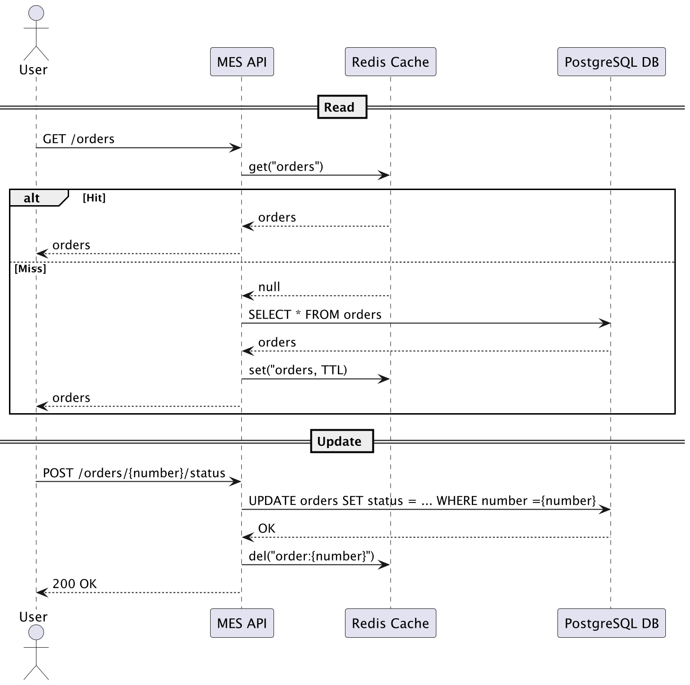

### Анализ

Подходящие части для кэширования:
1. Список заказов в MES - самая проблемная часть влияющая на заказы.
2. Результаты расчета стоимости изделий через API, если есть возможность не повторять расчёт.
3. Возможно НСИ, особенно SHOP Api, для повышения скорости работы интернет магазина.
(сконцентрируемся на первых 2ух, потому что в магазине проблем не обнаружено)

### Мотивация

1. Уменьшить нагрузку на базу данных
2. Повысить отзывчивость интерфейса, тем самым помочь оператором работать с заказами.
3. Ускорить отклик API при расчётах.
4. Снизить время загрузки главного дашборда MES
5. Уменьшить количество жалоб от партнёров по API

### Предлагаемое решение

MES: серверное кеширование, так как используется несколькими клиентами, работают различные операторы. 
API расчёта: серверное кеширование, т.к. используется внешними системами, отсутствует фронтэнд в принципе.
SHOP API при необходимости, тоже серверное, для каталога товаров.

Применение паттернов кэширования:
Я бы предложил варианты Cache-Aside для всех случаев.
Поскольку на важна консистентность, информации, и возможность ее получения в случае отсутствия в кэше. 
Добавление паттернов Write-Through/Refresh-Ahead означало бы добавление взаимовоздействия с базой только через 
кэш, в таком случае мы бы не управляли данными, и могли иметь избыточные записи на загрузку и обновления.
Write-Through/Refresh-Ahead используется для мгновенных изменений, где вероятность ошибки может быть и не так важна,
в нашем случае оба варианта не подходят, заказы мы не хотим терять, их скорость обработки засисит от оператора,
а значит мгновенных обновлений тоже не требуется.

Итог:
В MES часто важна точность и согласованность, а не миллисекундная задержка.
Write-Through может перегружать базу при частых, но не нужных обновлениях, 
или при изменении не очень интересующих статусах системы.
Refresh-Ahead хорошо работает, если можно предсказать, какие данные понадобятся, 
но у нас скорее более реактивный подход.

Для списка заказов:
Программная инвалидация по событию изменения статуса.
Временная инвалидация, если событий не было.

### Диаграмма последовательности:

https://www.planttext.com

[Ссылка на веб](http://www.plantuml.com/plantuml/uml/VL5DQy904BtlhtZaL4lze4SXejLjBLLCaqZFMtUnWJNApkPK-jyxIw9H4Ky9ypxclTanUULyjRD2RVpUOKt6YGEFYarnKAL7j9GP9ibx14NXUmccHXU4gThy62OqVvUKP4z-wqpskS3i9P3u8qGS8pLA8uw523lH7GLt3F4cS_JtJXj7WYSCrAuCROr_Y6eewWXbFUQ55m0QHlTaqkW350O125jQn5WoM1P4D-LbPMqh7d5Y7cPo8QSv7l6QhfPd6nYzixbDJstw9-JvedClNgd3ZR0-QENDZIibg-nqflvlMUs-ZVlharU-8d6UUftC9hbiVBb3Zfg46BrU3rzpcKhKUiH78t5HQVLn_H3QsARAy2ZX1xcgyZmO1AaOSvbgP_y1)

Для api:
Программная — при обновлении данных по материалам или тарифам.
Временная инвалидация. Если запросили тот же расчет повторно.

Инвалидация по ключу скорее будет не удобна из-за множества ключей, 
и акторов изменения статусов заказа, это делают все api. 
Реализация кажется сложной.

Шаги
1. Реализовать Redis/Valkey как основной сервер кеша.
2. Добавить обёртки кеша в сервисах MES и калькулятора API
3. Настроить TTL и механизмы инвалидации. 
4. Подключить логирование кэша (хиты/промахи).

Безопасность:
Redis будет развернут в приватной сети.
Подключение к Redis — только по паролю или через TLS.
Доступ к данным кеша только у сервисов, а не у внешних пользователей.
